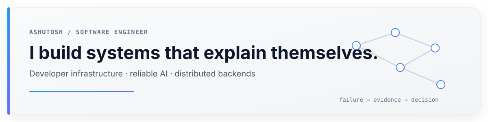

<p align="center">
  
</p>

<p align="center">
  
  
  
  
</p>

I like building software around the places where systems become hard to reason about: concurrent changes, durable execution, real-time collaboration, state, and failure.

The goal is usually the same — **make the hidden behavior visible, reproducible, and useful to an engineer.**

---

## `01 / selected work`

<table>
<tr>
<td width="50%" valign="top">

### [ProofMerge](https://github.com/Ashutosh-code-arch/proof-merge)

**When branches pass alone and fail together.**

An integration acceptance gate for concurrent changes. ProofMerge assembles candidate branches in an isolated worktree, verifies the combined application, and returns `PASS`, `WARN`, or `BLOCK` with evidence.

`Go` · `GitHub Actions` · `Docker` · `Playwright`

</td>
<td width="50%" valign="top">

### [Praxis](https://github.com/Ashutosh-code-arch/praxis)

**Agent workflows should be replayable, traceable, and governed.**

A durable runtime for multi-agent LLM workflows built around deterministic execution, OpenTelemetry traces, capability-scoped tools, evaluation, and replay.

`Python` · `Temporal` · `OpenTelemetry` · `FastAPI`

</td>
</tr>

<tr>
<td width="50%" valign="top">

### [CodeQuest](https://github.com/Ashutosh-code-arch/codequest)

**Collaborative coding without the tab-switching tax.**

Real-time coding rooms with shared Monaco editing, Yjs synchronization, Socket.IO, WebRTC video, Judge0 execution, and multi-language problem solving.

`TypeScript` · `React` · `Yjs` · `WebRTC` · `Judge0`

</td>
<td width="50%" valign="top">

### [AtlasExchange](https://github.com/Ashutosh-code-arch/AtlasExchange)

**Market mechanics instead of another CRUD demo.**

A full-stack exchange simulator with a price-time matching engine, simulated wallets, double-entry accounting, WebSocket updates, and live reference charts.

`TypeScript` · `React` · `PostgreSQL` · `WebSocket`

</td>
</tr>
</table>

---

## `02 / how I think about software`

```text
reproducible failure   > mysterious failure
evidence               > assumptions
small interfaces       > framework magic
explicit state         > invisible state
boring reliability     > clever fragility
```

I am most interested in the point where a useful demo has to become a system you can **inspect, replay, debug, and trust**.

---

## `03 / toolbox`

<p>
  
  
  
  
  
  
</p>

<p>
  
  
  
  
  
  
</p>

---

## `04 / current vector`

```text
developer infrastructure
distributed systems
AI reliability
runtime design
observability
collaborative software
```

<sub>Building things that are useful to inspect, reason about, and trust.</sub>
